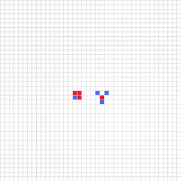

# Game Of Life

> Created with [p5.js](https://p5js.org/) and JavaScript/HTML/CSS.
  By Magno El Magnifico

**John Horton Conway** was an English mathematician who contributed
in several math theories: such us number theory or coding theory.

He also created the math branch of **cellular automata** with his
**Game of Life**.

> **Note**: He hated this game because it overshadowed the rest of
his career where he worked deeper.

This consists in a finite or infinite grid, and each cell have
several states; in this case `on/off`, `life/dead`, `0/1` or
`true/false`.

Each cell's state depends on its _neighbors_ (cells around it) by
the **game rules** which changes the game each _generation_
(game update):

+ **Birth rule**: A "dead", cell with precisely three "live"
  neighbors becomes live.

+ **Death rule**: A "live" cell with 0 or 1 neighbors dies of
  isolation; a "live" cell with 4 or more neighbors dies of
  overcrowding.

+ **Survival rule**: A "live" cell with 2 or 3 neighbors remains
  alive.

## Patterns

There are some different types of **patterns** that we can create:

+ **Still lives**: Forever alive and static.

+ **Oscilators**: The pattern itself has several states that repeats
  after some generations (_period_).

+ **Spaceships**: Patterns that are constantly moving across the
  grid.

+ **Methuselah**: Patterns that take lots of generations to stabilize
  (end up with only still lives, oscilators and spaceships) or die.

+ **Infinite growth**: Patterns that are always expanding, such us
  _guns_ (creates spaceships).

### Examples

This pattern (called **block**) is the simplest still lives. The
survival rule keeps it alive forever.

This **blinker** is the smallest oscilator with a period of 2. Here
all the rules are involved (birth rule creates new cells on the
side, death rule kills the others on the side and survival rule
keeps alive the center cell).

This is a **glider**, the simplest spaceship. It travels at _c_ speed
(light speed), the maximum allowed by this "Universe" (the birth
rule only allows cells to be created side by side, so you cannot
travel faster than 1 cell per generation).

 

This pattern is called **diehard**. It takes 130 generations to die
(_Mathuselah_).

This pattern (called **gosped glider gun**) creates a glider every
30 generations, so, in a infinite grid, it is growing forever.

### Usage

Combining some of these patterns and others, you can create
interesting things:

+ If gliders collide with a block in a specific position, the block
  will move. This can be used to make a _counter_.

+ It is also posible create `and`, `or` and `not` gates.

+ Combining these (counter and the gates) you can create a
  _Turing Machine_.

+ And more!

## Setup

No setup needed. Just open the `index.html` file on your browser, or
`game.html` which only contains the game.

## Configurations avaliable

You can configurate the game in several ways by changing the
variable value in the code (`game.js`) or using the JavaScript console:

+ **Size**: `w`, line `2` (Default: 600).
+ **Number of cells per row/column**: `ncells`, line `3` (Default: 20).
+ **Update time**: `update_time` (milliseconds), line `6` (Default: 100).
+ **Render grid**: `render_grid` (`true`/`false`), line `7` (Default: `true`).
+ **Neighbors counting style**: change how the neighbors are counted
  (more info [here](https://en.wikipedia.org/wiki/Cellular_automaton#Overview)).
  `moore` (`true` for Moore neighbors and `false` for
  von Neumann neighbors), line `8` (Default: `true`).

## Links
+ John Horton Conway, [Wikipedia](https://en.wikipedia.org/wiki/John_Horton_Conway)
+ The Game of Live, [Wikipedia](https://en.wikipedia.org/wiki/Conway%27s_Game_of_Life)
+ Cellular automaton, [Wikipedia](https://en.wikipedia.org/wiki/Cellular_automaton)
+ El juego de la vida, [Wikipedia](https://es.wikipedia.org/wiki/Juego_de_la_vida) (Spanish)
+ El juego de la vida, [Youtube](https://www.youtube.com/embed/omMcrvVGTMs), by Dot CSV (Spanish)
+ Programa el juego de la vida... en 10 minutos, [Youtube](https://www.youtube.com/watch?v=qPtKv9fSHZY) by Dot CSV (Spanish)

## Contact
+ marcosgranja317@gmail.com
